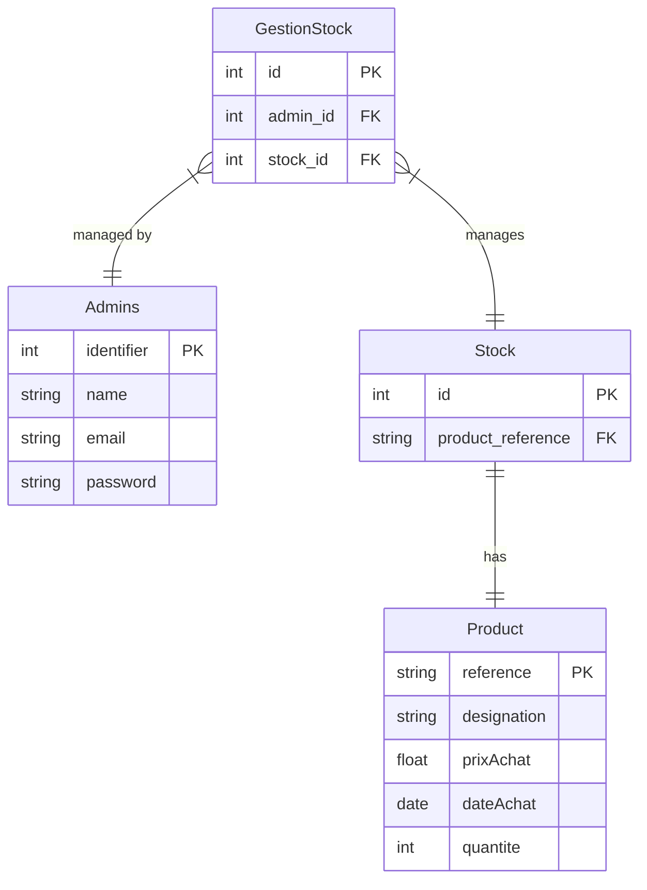

```mermaid
erDiagram
    Product {
        string reference PK
        string designation
        float prixAchat
        date dateAchat
        int quantite
    }
    
    Admins {
        int identifier PK
        string name
        string email
        string password
    }
    
    Stock {
        int id PK
        string product_reference FK
    }
    
    GestionStock {
        int id PK
        int admin_id FK
        int stock_id FK
    }

    Stock ||--|| Product : "has"
    GestionStock }|--|| Stock : "manages"
    GestionStock }|--|| Admins : "managed by"
```
