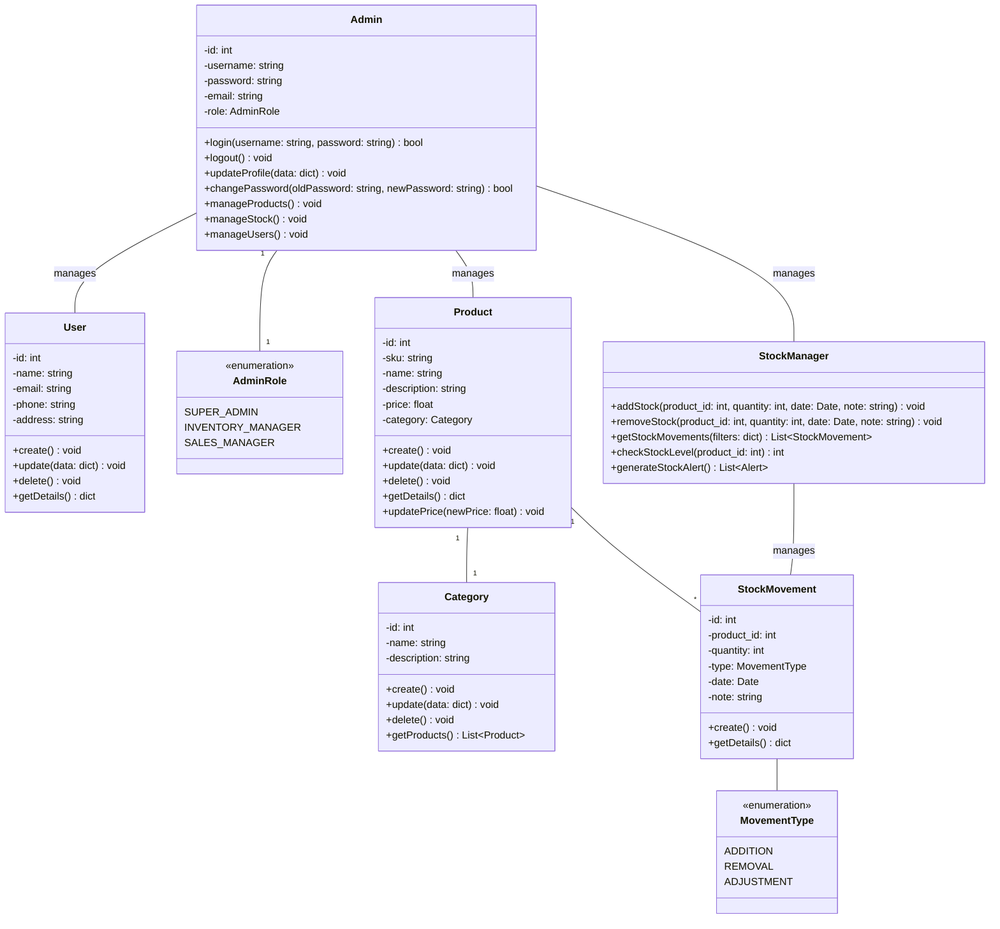

```mermaid
classDiagram
    %% User and Admin Management
    class User {
        -id: int
        -name: string
        -email: string
        -phone: string
        -address: string
        +create() void
        +update(data: dict) void
        +delete() void
        +getDetails() dict
    }

    class Admin {
        -id: int
        -username: string
        -password: string
        -email: string
        -role: AdminRole
        +login(username: string, password: string) bool
        +logout() void
        +updateProfile(data: dict) void
        +changePassword(oldPassword: string, newPassword: string) bool
        +manageProducts() void
        +manageStock() void
        +manageUsers() void
    }

    class AdminRole {
        <<enumeration>>
        SUPER_ADMIN
        INVENTORY_MANAGER
        SALES_MANAGER
    }

    %% Product Management
    class Product {
        -id: int
        -sku: string
        -name: string
        -description: string
        -price: float
        -category: Category
        +create() void
        +update(data: dict) void
        +delete() void
        +getDetails() dict
        +updatePrice(newPrice: float) void
    }

    class Category {
        -id: int
        -name: string
        -description: string
        +create() void
        +update(data: dict) void
        +delete() void
        +getProducts() List~Product~
    }

    %% Stock Management
    class StockManager {
        +addStock(product_id: int, quantity: int, date: Date, note: string) void
        +removeStock(product_id: int, quantity: int, date: Date, note: string) void
        +getStockMovements(filters: dict) List~StockMovement~
        +checkStockLevel(product_id: int) int
        +generateStockAlert() List~Alert~
    }

    class StockMovement {
        -id: int
        -product_id: int
        -quantity: int
        -type: MovementType
        -date: Date
        -note: string
        +create() void
        +getDetails() dict
    }

    class MovementType {
        <<enumeration>>
        ADDITION
        REMOVAL
        ADJUSTMENT
    }

    %% Relationships
    Admin "1" -- "1" AdminRole
    Admin -- User : manages
    Admin -- Product : manages
    Admin -- StockManager : manages
    Product "1" -- "1" Category
    Product "1" -- "*" StockMovement
    StockManager -- StockMovement : manages
    StockMovement -- MovementType
```