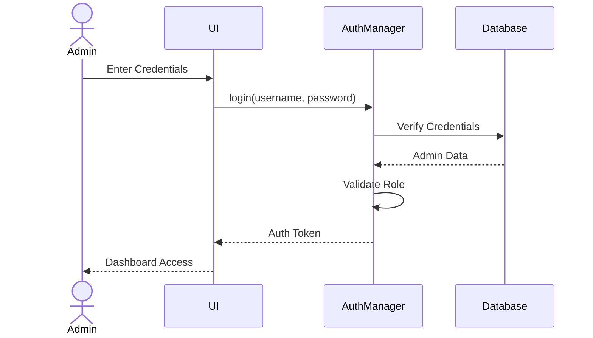
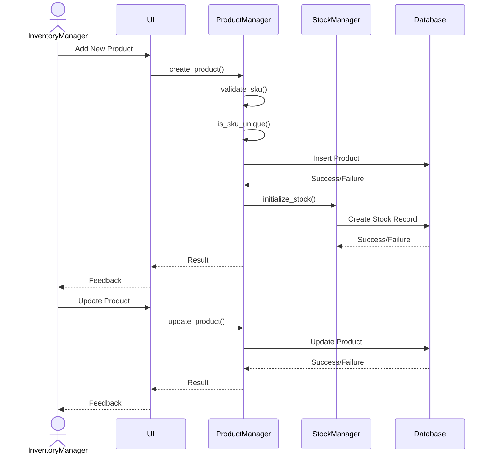
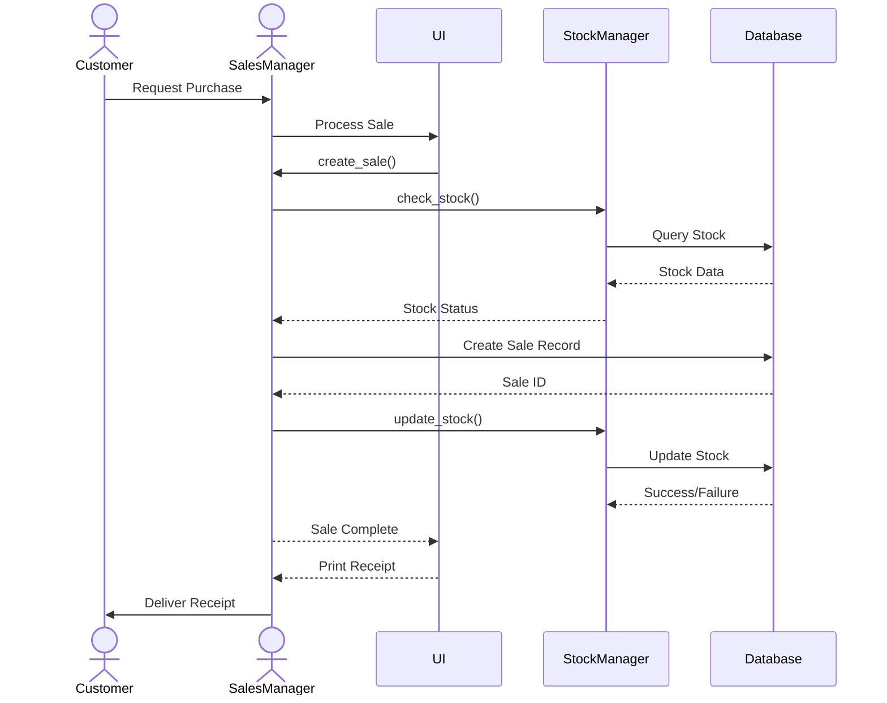

# Sequence Diagrams

## Admin Authentication Sequence

```mermaid
sequenceDiagram
    actor Admin
    participant UI
    participant AuthManager
    participant Database

    Admin->>UI: Enter Credentials
    UI->>AuthManager: login(username, password)
    AuthManager->>Database: Verify Credentials
    Database-->>AuthManager: Admin Data
    AuthManager->>AuthManager: Validate Role
    AuthManager-->>UI: Auth Token
    UI-->>Admin: Dashboard Access
```

## Product Management Sequence

```mermaid
sequenceDiagram
    actor InventoryManager
    participant UI
    participant ProductManager
    participant StockManager
    participant Database

    %% Add Product Flow
    InventoryManager->>UI: Add New Product
    UI->>ProductManager: create_product()
    ProductManager->>ProductManager: validate_sku()
    ProductManager->>ProductManager: is_sku_unique()
    ProductManager->>Database: Insert Product
    Database-->>ProductManager: Success/Failure
    ProductManager->>StockManager: initialize_stock()
    StockManager->>Database: Create Stock Record
    Database-->>StockManager: Success/Failure
    ProductManager-->>UI: Result
    UI-->>InventoryManager: Feedback

    %% Update Product Flow
    InventoryManager->>UI: Update Product
    UI->>ProductManager: update_product()
    ProductManager->>Database: Update Product
    Database-->>ProductManager: Success/Failure
    ProductManager-->>UI: Result
    UI-->>InventoryManager: Feedback
```

## Sales Process Sequence

```mermaid
sequenceDiagram
    actor Customer
    actor SalesManager
    participant UI
    participant SalesManager
    participant StockManager
    participant Database

    Customer->>SalesManager: Request Purchase
    SalesManager->>UI: Process Sale
    UI->>SalesManager: create_sale()
    SalesManager->>StockManager: check_stock()
    StockManager->>Database: Query Stock
    Database-->>StockManager: Stock Data
    StockManager-->>SalesManager: Stock Status
    SalesManager->>Database: Create Sale Record
    Database-->>SalesManager: Sale ID
    SalesManager->>StockManager: update_stock()
    StockManager->>Database: Update Stock
    Database-->>StockManager: Success/Failure
    SalesManager-->>UI: Sale Complete
    UI-->>SalesManager: Print Receipt
    SalesManager->>Customer: Deliver Receipt
```
