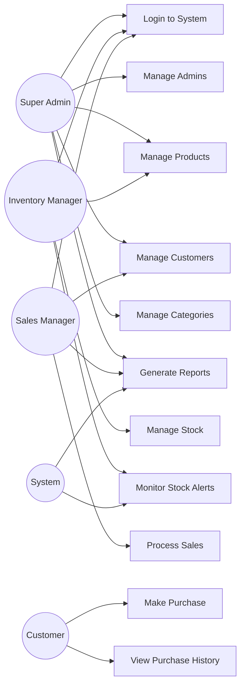

# Use Case Diagram

```mermaid
graph LR
    %% Actors
    SuperAdmin((Super Admin))
    InventoryManager((Inventory Manager))
    SalesManager((Sales Manager))
    Customer((Customer))
    System((System))

    %% Use Cases
    Login[Login to System]
    ManageAdmins[Manage Admins]
    ManageProducts[Manage Products]
    ProcessSales[Process Sales]
    ManageStock[Manage Stock]
    GenerateReports[Generate Reports]
    ManageCustomers[Manage Customers]
    MonitorStockAlerts[Monitor Stock Alerts]
    ManageCategories[Manage Categories]
    ViewPurchaseHistory[View Purchase History]
    MakePurchase[Make Purchase]

    %% Super Admin connections
    SuperAdmin --> Login
    SuperAdmin --> ManageAdmins
    SuperAdmin --> ManageProducts
    SuperAdmin --> ManageCustomers
    SuperAdmin --> ManageCategories
    SuperAdmin --> GenerateReports

    %% Inventory Manager connections
    InventoryManager --> Login
    InventoryManager --> ManageStock
    InventoryManager --> ManageProducts
    InventoryManager --> MonitorStockAlerts

    %% Sales Manager connections
    SalesManager --> Login
    SalesManager --> ProcessSales
    SalesManager --> ManageCustomers
    SalesManager --> GenerateReports

    %% Customer connections
    Customer --> MakePurchase
    Customer --> ViewPurchaseHistory

    %% System connections
    System --> MonitorStockAlerts
    System --> GenerateReports
```
