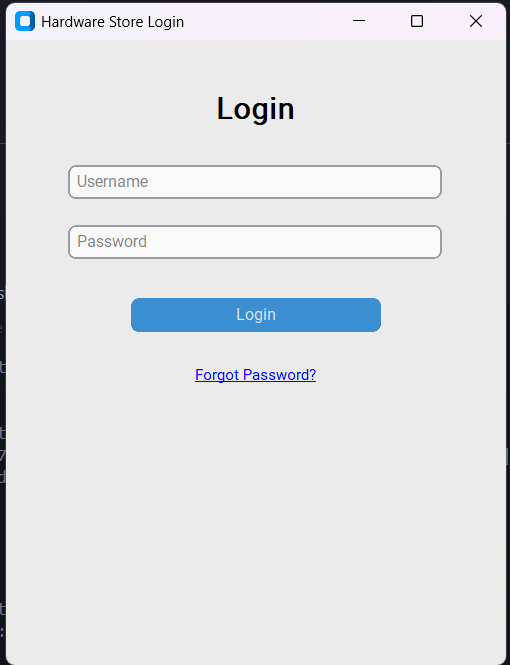

# Hardware Store Management System - User Walkthrough

## 1. Getting Started

### Login Interface
The system starts with a clean, user-friendly login interface:



Key elements of the login page:
* **Title Bar**: Shows "Hardware Store Login" with minimize and close buttons
* **Username Field**: Text input for entering admin username
* **Password Field**: Secure password input (masked for privacy)
* **Login Button**: Blue button to submit credentials
* **Forgot Password**: Link below login button for password recovery

Security features:
* Password is masked for security
* Failed login attempts are logged
* Session timeout for security
* Role-based access control

Access levels:
* Super Admin: Full system access
* Inventory Manager: Stock and product management
* Sales Manager: Sales and customer operations

### Dashboard Overview
* Main control center
* Quick access to all functions
* Real-time alerts and notifications

[Dashboard Image]
```
Place dashboard.png here
Description: Main dashboard showing key metrics and navigation options
```

## 2. Product Management

### Product Catalog
* View all products in grid/list format
* Filter and search capabilities
* Quick stock level indicators

[Product Catalog Image]
```
Place product_catalog.png here
Description: Product listing page with search and filter options
```

### Adding New Products
* Product creation form
* SKU generation
* Category assignment
* Stock level setup

[Add Product Image]
```
Place add_product.png here
Description: New product creation form with all fields
```

## 3. Stock Management

### Inventory Overview
* Current stock levels
* Low stock alerts
* Stock movement history

[Inventory Image]
```
Place inventory.png here
Description: Inventory management screen showing stock levels
```

### Stock Operations
* Add stock
* Remove stock
* Adjust quantities
* Record movements

[Stock Operations Image]
```
Place stock_operations.png here
Description: Interface for managing stock movements
```

## 4. Sales Process

### Checkout Interface
* Product selection
* Quantity adjustment
* Price calculation
* Payment processing

[Checkout Image]
```
Place checkout.png here
Description: Point of sale interface for processing sales
```

### Sales History
* Transaction records
* Receipt generation
* Sales analytics

[Sales History Image]
```
Place sales_history.png here
Description: Sales history and analytics dashboard
```

## 5. Category Management

### Category Structure
* Hierarchical view
* Category creation
* Product assignment

[Categories Image]
```
Place categories.png here
Description: Category management interface
```

## 6. User Management

### User Roles
* Admin dashboard
* User creation
* Permission management

[User Management Image]
```
Place user_management.png here
Description: User and role management interface
```

## 7. Reports and Analytics

### Dashboard Reports
* Sales trends
* Stock levels
* Popular products
* Revenue analysis

[Reports Image]
```
Place reports.png here
Description: Reports and analytics dashboard
```

## Common Operations

### 1. Processing a Sale
1. Access checkout interface
2. Scan or select products
3. Adjust quantities if needed
4. Calculate total
5. Process payment
6. Generate receipt

### 2. Managing Stock
1. Monitor stock alerts
2. Record new stock arrivals
3. Adjust quantities
4. Track movements
5. Generate reports

### 3. Product Updates
1. Locate product in catalog
2. Edit product details
3. Update stock levels
4. Save changes
5. Verify updates

## Keyboard Shortcuts

### General Navigation
* `F1` - Help
* `Esc` - Cancel/Close
* `Ctrl+H` - Return to Dashboard

### Product Management
* `Ctrl+N` - New Product
* `Ctrl+F` - Find Product
* `Ctrl+E` - Edit Selected

### Sales
* `F2` - New Sale
* `F3` - Quick Search
* `F4` - Process Payment

## Tips and Best Practices

### Daily Operations
* Check stock alerts
* Process pending orders
* Update product prices
* Back up sales data

### Maintenance
* Regular inventory checks
* Price updates
* Category organization
* User access review

### Troubleshooting
* Common error messages
* Quick solutions
* Support contacts
* Recovery procedures
