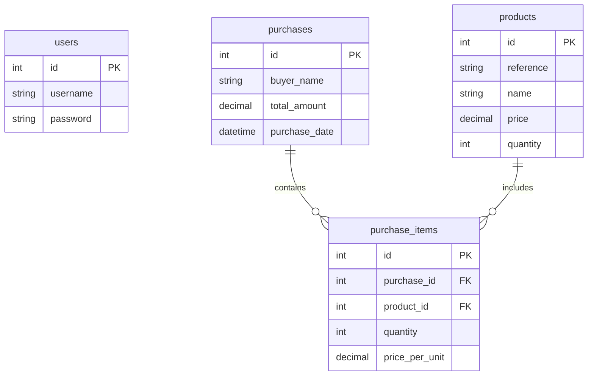

# نظام إدارة متجر الأدوات الصناعية
## وصف المشروع
هذا النظام هو تطبيق سطح المكتب لإدارة متجر للأدوات الصناعية، يتيح إدارة المخزون وتتبع المبيعات بشكل فعال.

## المميزات الرئيسية
1. نظام تسجيل الدخول
   - واجهة تسجيل دخول بسيطة
   - التحقق من صحة بيانات المستخدم
   - اسم المستخدم وكلمة المرور الافتراضية: n/n

2. إدارة المنتجات
   - عرض قائمة المنتجات
   - البحث في المنتجات
   - عرض تفاصيل المنتج (الرقم المرجعي، الاسم، السعر، الكمية المتوفرة)

3. سلة المشتريات
   - إضافة منتجات للسلة
   - تعديل الكميات
   - حذف المنتجات
   - حساب المجموع الكلي
   - تسجيل معلومات المشتري

4. إدارة المخزون
   - تحديث تلقائي للمخزون
   - منع البيع عند نفاد المخزون
   - تتبع حركة المخزون

## هيكل قاعدة البيانات



## شرح الملفات

### main.py
الملف الرئيسي للتطبيق الذي يبدأ تشغيل النظام ويقوم بتهيئة الواجهة الرئيسية.

```python
# تهيئة التطبيق وإعداد النافذة الرئيسية
# إعداد قاعدة البيانات
# بدء واجهة تسجيل الدخول
```

### views/main_page.py
يحتوي على تعريف الواجهة الرئيسية وعناصرها.

#### ProductList كلاس
- عرض قائمة المنتجات
- خاصية البحث
- إضافة للسلة

#### PurchaseCart كلاس
- إدارة سلة المشتريات
- تعديل الكميات
- حساب المجموع
- إتمام عملية الشراء

### database/db_config.py
إعدادات الاتصال بقاعدة البيانات وتهيئتها.

```python
# إعدادات قاعدة البيانات
host = "localhost"
user = "root"
password = "0000"
database = "hardware_store"
```

### database/seed_data.py
بيانات تجريبية لتهيئة قاعدة البيانات.

## كيفية الاستخدام

1. تسجيل الدخول
   - استخدم اسم المستخدم: n
   - كلمة المرور: n

2. البحث عن المنتجات
   - استخدم شريط البحث في الأعلى
   - البحث يتم بالاسم أو الرقم المرجعي

3. إضافة للسلة
   - اضغط زر "إضافة" بجانب المنتج
   - عدل الكمية باستخدام الأزرار + و -
   - احذف المنتج باستخدام زر ×

4. إتمام الشراء
   - أدخل اسم المشتري
   - اضغط "إتمام الشراء"
   - تأكد من إتمام العملية

## المتطلبات التقنية

- Python 3.8+
- CustomTkinter 5.2.1
- MySQL
- mysql-connector-python 8.2.0

## التثبيت

1. إنشاء بيئة افتراضية
```bash
python -m venv venv
venv\Scripts\activate
```

2. تثبيت المكتبات
```bash
pip install -r requirements.txt
```

3. إعداد قاعدة البيانات
```bash
python database/db_config.py
python database/seed_data.py
```

4. تشغيل التطبيق
```bash
python main.py
```

## الأمان والتحسينات المستقبلية

1. تحسينات الأمان
   - تشفير كلمات المرور
   - إدارة الصلاحيات
   - تسجيل العمليات

2. تحسينات الواجهة
   - تقارير المبيعات
   - إحصائيات المخزون
   - لوحة تحكم المدير

3. تحسينات تقنية
   - نسخ احتياطي تلقائي
   - تحسين الأداء
   - تعدد المستخدمين
